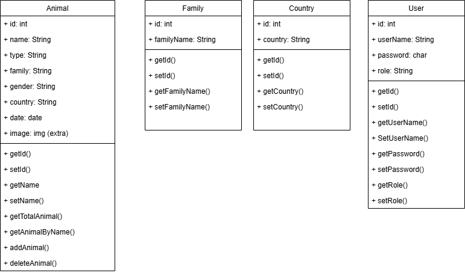

# Proyecto - Reserva Natural 

## Descripción del proyecto

Creación de una API para la gestión y mantenimiento de una reserva de animales.

## Objetivos del proyecto

- Reforzar los conceptos de creación de APIs.
- Aplicar relaciones de BBDD.
- Asentar conocimientos de login con Spring Security y Basic Auth o JWT.

## Contexto del proyecto

Una reserva natural ha pedido un sistema de gestión para el control de su fauna.

## Requisitos funcionales del Proyecto

- Gestión de Animales.
- Autenticación (ROLE_ADMIN ).
- Generación y validación de tokens JWT o de las COOKIES de sesión en caso de usar Basic Auth para sesiones seguras.​

## Requisitos del Sistema de autenticación

- Sistema gestionado solo por un usuario con role de administrador.
- El sistema de autenticación podrá ser de tipo Basic Auth o JWT.

## Solicitudes públicas

- Obtener la lista de todos los animales de la reserva con paginación (máximo 20 animales).
- Obtener la lista de animales según la familia solicitada con paginación (máximo 10 animales).
- Obtener la lista de animales según el país de origen sin paginación.
- Obtener la lista de animales según familia y tipo.

## Solicitudes privadas

- Obtener la cantidad total de animales.
- Obtener un animal según su nombre.
- Añadir un nuevo ejemplar.
- Suprimir un ejemplar.
- Editar un ejemplar​.

## Familias mínimas requeridas
- Félidos(León, Tigre, Leopardo, etc...)
- Cánidos (Zorro,Lobos,Chacales, etc...)
- Reptiles (Cocodrilos,Serpientes,Iguanas, etc...)
- Mustelids (Nútria,Comadrejas,Tejones, etc...)
- Leporidae (Conejos y Liebres)

## Para el registro de cada ejemplar se deberá introducir los siguientes datos:

- Nombre
- Tipo
- Familia a la que pertenece
- Género
- País de origen
- Fecha de ingreso
- Imagen (extra)​

## Extra

- Cada ejemplar tendrá su foto.

## Cronograma del Proyecto
1 Sprint de 4 semanas.

## Instalación

- Java 21
- Spring boot
- Spring boot dependencies:

  - Spring Boot DevTools
  - Spring Web
  - Spring Data JPA
  - H2 Database
  - Spring Security
  - MySQL Driver
  - Docker Compose Support

## Testing

The project uses JUnit 5 for unit tests.

## Diagrama de clase

